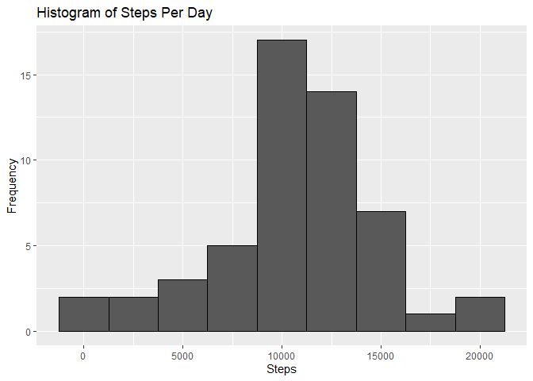
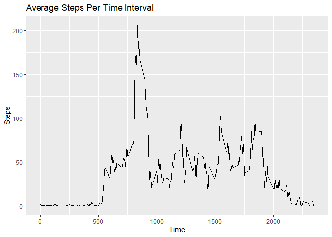
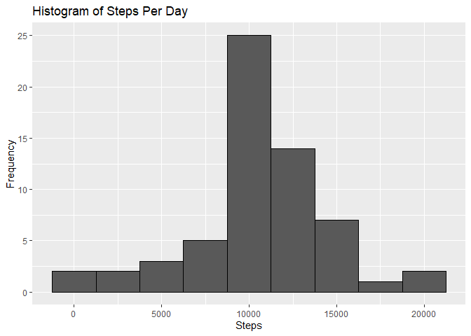
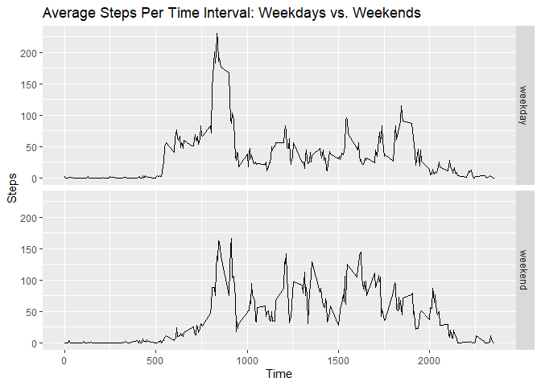

## Loading and preprocessing the data

*1. Load the data (i.e.read.csv())*


```r
destfile <- "activity.zip"
unzip(destfile)
activity <- read.csv("activity.csv")
```
*2. Process/transform the data (if necessary) into a format suitable for your analysis*

```r
#check the structure
str(activity)
```

```
## 'data.frame':	17568 obs. of  3 variables:
##  $ steps   : int  NA NA NA NA NA NA NA NA NA NA ...
##  $ date    : Factor w/ 61 levels "2012-10-01","2012-10-02",..: 1 1 1 1 1 1 1 1 1 1 ...
##  $ interval: int  0 5 10 15 20 25 30 35 40 45 ...
```

```r
#reformat date
activity$date<-ymd(activity$date)
str(activity)
```

```
## 'data.frame':	17568 obs. of  3 variables:
##  $ steps   : int  NA NA NA NA NA NA NA NA NA NA ...
##  $ date    : Date, format: "2012-10-01" "2012-10-01" ...
##  $ interval: int  0 5 10 15 20 25 30 35 40 45 ...
```
## What is mean total number of steps taken per day?
*For this part of the assignment, you can ignore the missing values in the dataset.*

*1. Calculate the total number of steps taken per day*


```r
# Calculate the total number of steps
total_steps <- activity %>% 
  group_by(date) %>% 
  summarise(totalsteps=sum(steps))
# View
total_steps
```

```
## # A tibble: 61 x 2
##    date       totalsteps
##    <date>          <int>
##  1 2012-10-01         NA
##  2 2012-10-02        126
##  3 2012-10-03      11352
##  4 2012-10-04      12116
##  5 2012-10-05      13294
##  6 2012-10-06      15420
##  7 2012-10-07      11015
##  8 2012-10-08         NA
##  9 2012-10-09      12811
## 10 2012-10-10       9900
## # ... with 51 more rows
```
*2. If you do not understand the difference between a histogram and a barplot, research the difference between them. Make a histogram of the total number of steps taken each day*

```r
# Create the histogram of the total number of steps per day
ggplot(total_steps,aes(x=totalsteps))+
  geom_histogram(color="black",binwidth = 2500,na.rm=T)+
  ggtitle("Histogram of Steps Per Day")+
  xlab("Steps")+
  ylab("Frequency")
```

<!-- -->

*3. Calculate and report the mean and median of the total number of steps taken per day*

```r
# Mean
mean(total_steps$totalsteps,na.rm=T)
```

```
## [1] 10766.19
```

```r
# Median            
median(total_steps$totalsteps,na.rm=T)
```

```
## [1] 10765
```

## What is the average daily activity pattern?

*1. Make a time series plot (i.e. type="l") of the 5-minute interval (x-axis) and the average number of steps taken, averaged across all days (y-axis)*


```r
# Create a dataframe with steps per time
steps_per_time<-activity %>% 
  group_by(interval) %>% 
  summarise(stepspertime=mean(steps,na.rm=T))

# Create the line plot
ggplot(steps_per_time,aes(interval,stepspertime))+
  geom_line()+
  ggtitle("Average Steps Per Time Interval")+
  xlab("Time")+
  ylab("Steps")
```

<!-- -->

*2. Which 5-minute interval, on average across all the days in the dataset, contains the maximum number of steps?*

```r
# Find the interval
steps_per_time %>% 
  filter(stepspertime==max(stepspertime))
```

```
## # A tibble: 1 x 2
##   interval stepspertime
##      <int>        <dbl>
## 1      835         206.
```
The 5-minute interval that contains the maximum number of steps (206) is 835.

## Imputing missing values
*Note that there are a number of days/intervals where there are missing values (coded as NA). The presence of missing days may introduce bias into some calculations or summaries of the data.*

*1. Calculate and report the total number of missing values in the dataset (i.e. the total number of rows with NAs)*


```r
# total number of missing values
sum(is.na(activity$steps))
```

```
## [1] 2304
```

*2. Devise a strategy for filling in all of the missing values in the dataset. The strategy does not need to be sophisticated. For example, you could use the mean/median for that day, or the mean for that 5-minute interval, etc.*

```r
#Add a column that fills in missing values with the mean for 5-minute interval
activity<-activity %>% 
  mutate(complete_steps=ifelse(is.na(steps),round(steps_per_time$stepspertime[match(interval,steps_per_time$interval)],0),steps))
# See the first 5 rows
head(activity)
```

```
##   steps       date interval complete_steps
## 1    NA 2012-10-01        0              2
## 2    NA 2012-10-01        5              0
## 3    NA 2012-10-01       10              0
## 4    NA 2012-10-01       15              0
## 5    NA 2012-10-01       20              0
## 6    NA 2012-10-01       25              2
```

*3. Create a new dataset that is equal to the original dataset but with the missing data filled in.*

```r
# Create a new dataframe with the imputed steps column
activity_full <- activity %>% 
  select(complete_steps,interval,date)
# See first 5 rows
head(activity_full)
```

```
##   complete_steps interval       date
## 1              2        0 2012-10-01
## 2              0        5 2012-10-01
## 3              0       10 2012-10-01
## 4              0       15 2012-10-01
## 5              0       20 2012-10-01
## 6              2       25 2012-10-01
```

*4. Make a histogram of the total number of steps taken each day and Calculate and report the mean and median total number of steps taken per day. Do these values differ from the estimates from the first part of the assignment? What is the impact of imputing missing data on the estimates of the total daily number of steps?*

```r
# Prepare a dataframe for the histogram
activity_full_steps<-activity_full %>% 
  group_by(date) %>% 
  summarise(steps=sum(complete_steps))
# Plot the histogram
ggplot(activity_full_steps,aes(x=steps))+
  geom_histogram(color="black",binwidth = 2500,na.rm=T)+
  ggtitle("Histogram of Steps Per Day")+
  xlab("Steps")+
  ylab("Frequency")
```

<!-- -->

```r
# Mean
mean(activity_full_steps$steps)
```

```
## [1] 10765.64
```

```r
# Median
median(activity_full_steps$steps)
```

```
## [1] 10762
```

Imputing missing data affects the mean and the median of the total daily number of steps a little, but not substantially (10766.2 vs. 10765.6 for the mean and 10765 vs. 10762 for the median). Different methods for replacing missing values may result in different numbers.

## Are there differences in activity patterns between weekdays and weekends?
*For this part the weekdays() function may be of some help here. Use the dataset with the filled-in missing values for this part.*

*1. Create a new factor variable in the dataset with two levels – “weekday” and “weekend” indicating whether a given date is a weekday or weekend day.*

```r
# Mutate the weekday/weekend factor variable
activity_full<-activity_full %>% 
  mutate(weekday=weekdays(date)) %>% 
  mutate(daytype=as.factor(ifelse(weekday=='Saturday'|weekday=='Sunday','weekend','weekday')))
# See the first 5 rows
head(activity_full)
```

```
##   complete_steps interval       date weekday daytype
## 1              2        0 2012-10-01  Monday weekday
## 2              0        5 2012-10-01  Monday weekday
## 3              0       10 2012-10-01  Monday weekday
## 4              0       15 2012-10-01  Monday weekday
## 5              0       20 2012-10-01  Monday weekday
## 6              2       25 2012-10-01  Monday weekday
```

*2. Make a panel plot containing a time series plot (i.e. type="l") of the 5-minute interval (x-axis) and the average number of steps taken, averaged across all weekday days or weekend days (y-axis). See the README file in the GitHub repository to see an example of what this plot should look like using simulated data.*

```r
# Prepare the dataframe
steps_per_time_impute<-activity_full %>% 
  group_by(interval,daytype) %>% 
  summarise(stepspertime_impute=mean(complete_steps))

# Create the line plot by day type
ggplot(steps_per_time_impute,aes(interval,stepspertime_impute))+
  geom_line()+
  ggtitle("Average Steps Per Time Interval: Weekdays vs. Weekends")+
  xlab("Time")+
  ylab("Steps")+
  facet_grid(daytype ~ .)
```

<!-- -->
